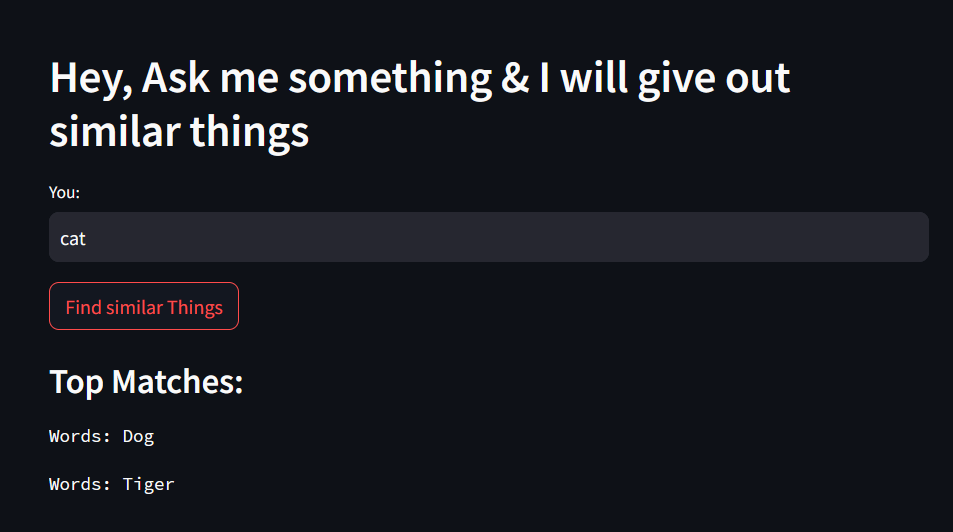
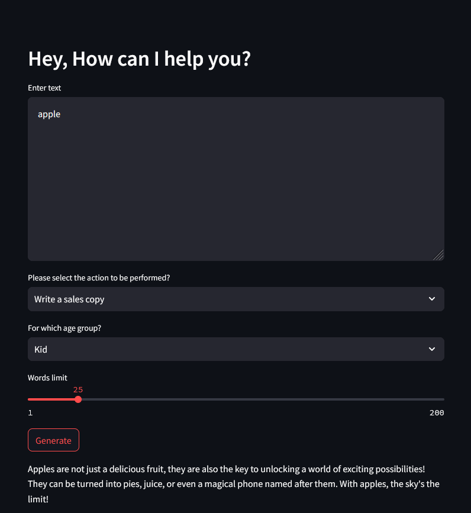
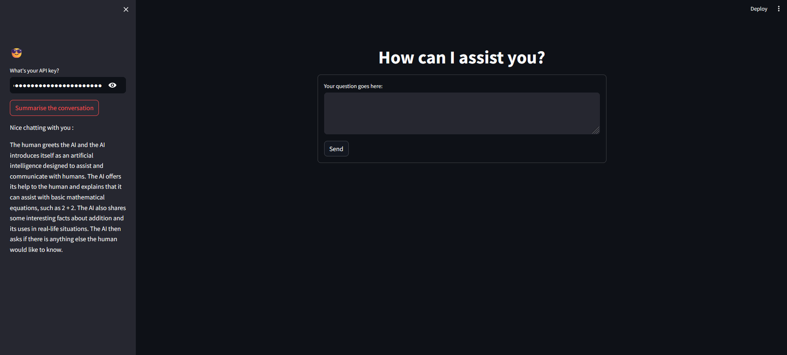

# LLM Projects

### Implementing 16 AI projects using OpenAI, LLAMA2 and HuggingFace and services such as langchain, pinecone, raptor, etc

## Table of Contents:
+ [Simple Q&A app](#project-1-simple-qa-app)
+ [Simple Conversational app](#project-2-simple-conversational-app)
+ [Similarity Finder App](#project-3-similarity-finder-app)
+ [Marketing Campaign App](#project-4-marketing-campaign-app)
+ [ChatGPT Clone with Chat Summarization](#project-5-chatgpt-clone-with-chat-summarization)
+ [MCQ Quiz Creator Bot](#project-6-mcq-quiz-creator-bot)
+ [CSV Data Analysis Tool](#project-7-csv-data-analysis-tool)
+ [YouTube Script Writing Tool](#project-8-youtube-script-writing-tool)
+ [ChatBot Support for your Website](#project-9-chatbot-support-for-your-website)
+ [Automatic Ticket Classification Tool](#project-10-automatic-ticket-classification-tool)
+ [Resume Screening Assistance](#project-11-resume-screening-assistance)
+ [Email Generator using LLAMA2](#project-12-email-generator-using-llama2)
+ [Invoice Extraction Bot](#project-13-invoice-extraction-bot)
+ [Text to SQL Helper Tool](#project-14-text-to-sql-helper-tool)
+ [Customer Care Call Summary Alert](#project-15-customer-care-call-summary-alert)
+ [Code Review Analyst App](#project-16--code-review-analyst-app)

## Project 1: Simple Q&A app
 + A simple straightforward Question and Answer chatbot constructed using a LLM API, which operates without retaining any memory of past interactions. 
 + The query is read from the streamlit ui and sent to an llm.
 + The llm response is written onto the streamlit ui.
 + Deployed on HuggingFace

### LLM: 
+ gemini-pro

### Framework:
+ LangChain
+ streamlit

## Project 2: Simple Conversational app
+ A minimal conversational chatbot which recalls its past interactions, built using a LLM API similar to [Project 1](#project-1-simple-qa-app)
+ Additionally, the previous chats are stored in a streamlit session state(stores data between sessions).
+ The current query is added onto this session state before generating a response to provide context.
+ Deployed on HuggingFace

### LLM: 
+ gemini-1.5-pro-latest

### Framework:
+ LangChain
+ streamlit

## Project 3: Similarity Finder App
+ The app finds words similar to a user-provided input from a given csv file
+ The csv data is converted into embeddings using the llm.
+ The vectors are stored in FIASS database.
+ A similarity search is applied on the input word using the vector database.
+ The output words are displayed onto the streamlit ui.

### LLM: 
+ OpenAI

### Framework:
+ LangChain
+ streamlit

## Project 4: Marketing Campaign App
+ Given a description, the app generates marketing content based on the options chosen.
+ The options include an action: sales copy, tweet and product description over an age group: kid, adult and senior citizen.
+ The llm is a given a example selector to select between the age group.
+ The example selector provides context for the response generated for different age groups.
+ the llm generates a response based on the data from the example selector and the prompt table for the input query.
+ The response is written onto the streamlit ui.

### LLM: 
+ gpt-3.5-turbo-instruct

### Framework:
+ LangChain
+ streamlit

## Project 5: ChatGPT Clone with Chat Summarization
+ A chatgpt clone emulated onto a streamlit ui with an extra feature for summarizing the chat between user and ai.
+ For every query, a response is generated and stored in the conversation chain.
+ The conversation chain stores a summary of the past conversations using the llm.
+ The conversation chain is stored in a streamlit session state.

### LLM: 
+ gpt-3.5-turbo-instruct

### Framework:
+ LangChain
+ streamlit

## Project 6: MCQ Quiz Creator Bot
+ The bot creates mcq based questions using the documents provided.
+ The documents are converted into chunks of data to feed into the llm
+ The chunks of data is turned into to vector embeddings and stored in a pinecone databse
+ A similarity search is performed from the vector database using the user input.
+ The llm generates a response using the user input and the relevant vectors.
+ The output is converted into json using a json template.

### LLM:
+ all-MiniLM-L6-v2

### Framework:
+ LangChain
+ Pinecone

## Project 7: CSV Data Analysis Tool

## Project 8: YouTube Script Writing Tool

## Project 9: ChatBot Support for your Website

## Project 10: Automatic Ticket Classification Tool

## Project 11: Resume Screening Assistance

## Project 12: Email Generator using LLAMA2

## Project 13: Invoice Extraction Bot

## Project 14: Text to SQL Helper Tool

## Project 15: Customer Care Call Summary Alert

## Project 16:  Code Review Analyst App

