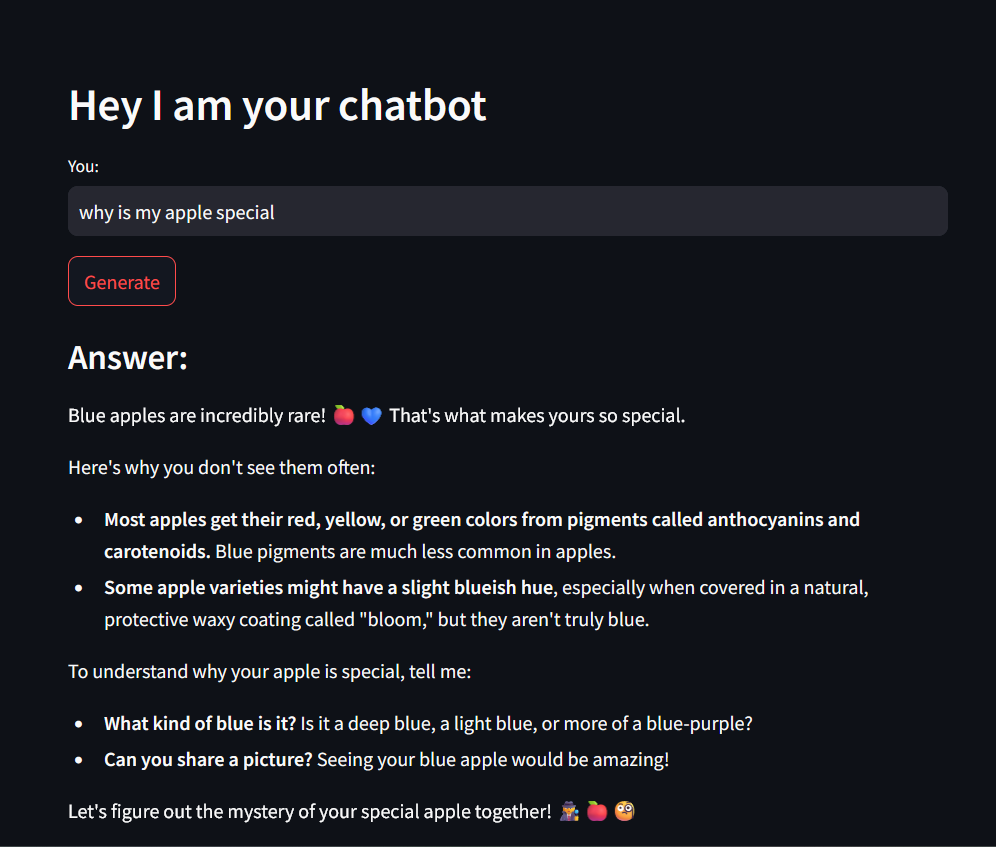

# LLM Projects

Implementing 16 projects presented in the course: [Master LangChain Build #16 AI Apps-OpenAI,LLAMA2,HuggingFace](https://www.udemy.com/course/learn-langchain-go-from-zero-to-hero-build-ai-apps)

## Project 1: Simple Q&A app
A simple straightforward Question and Answer chatbot constructed using a LLM API, which operates without retaining any memory of past interactions.

### LLM: 
+ gemini-pro

### Framework:
+ LangChain
+ streamlit

#### Deployed on [HuggingFace](https://huggingface.co/)
## Project 2: Simple Conversational app
A minimal conversational chatbot which recalls its past interactions, built using a LLM API similar to [Project 1](#project-1-simple-qa-app)

### LLM: 
+ gemini-1.5-pro-latest

### Framework:
+ LangChain
+ streamlit

#### Deployed on [HuggingFace](https://huggingface.co/)
