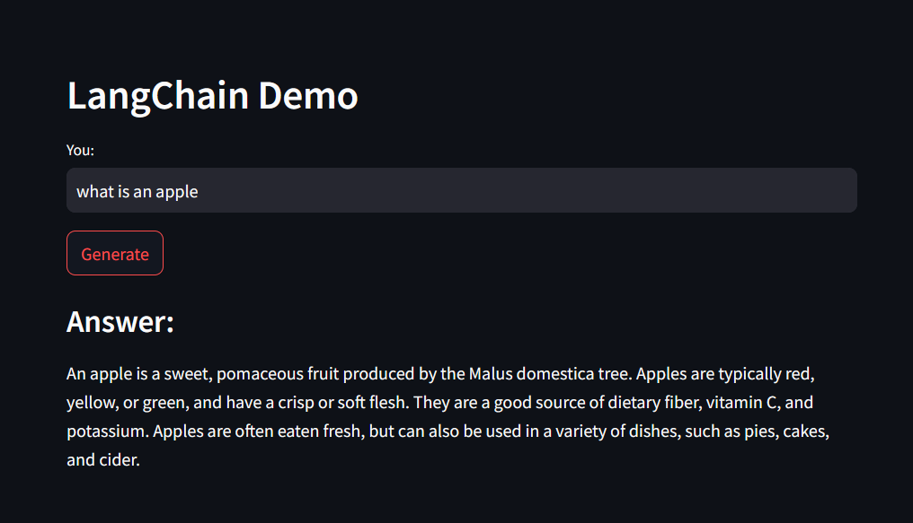

# App 1: Simple Q&A app
 + A simple straightforward Question and Answer chatbot constructed using a LLM API, which operates without retaining any memory of past interactions. 
 + The query is read from the streamlit ui and sent to an llm.
 + The llm response is written onto the streamlit ui.
 + Deployed on HuggingFace

## LLM: 
+ gemini-pro

## Framework:
+ LangChain
+ streamlit