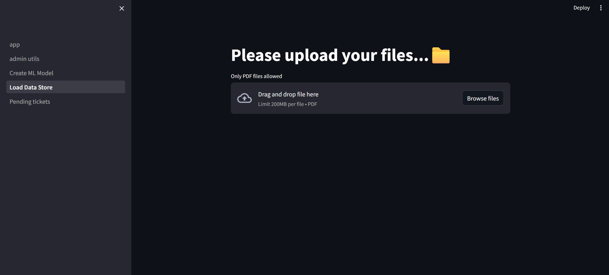
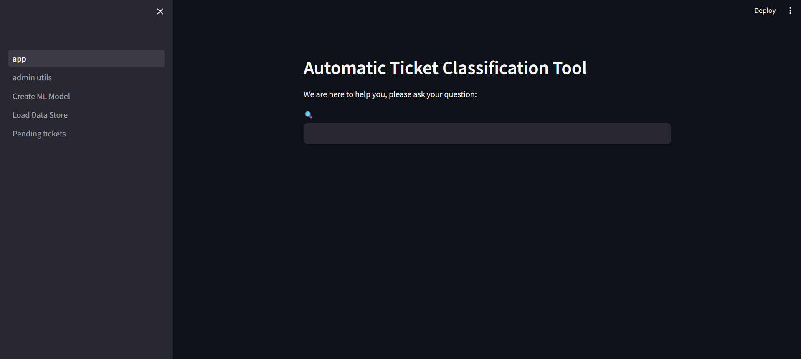
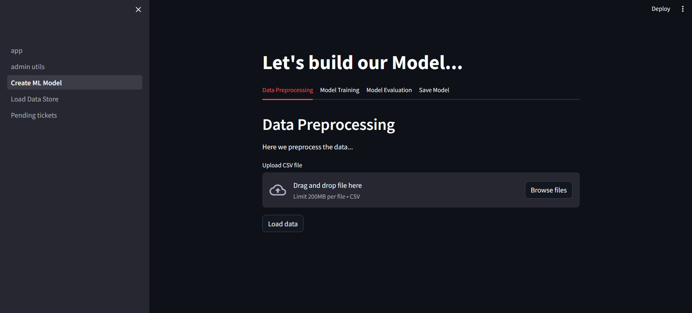
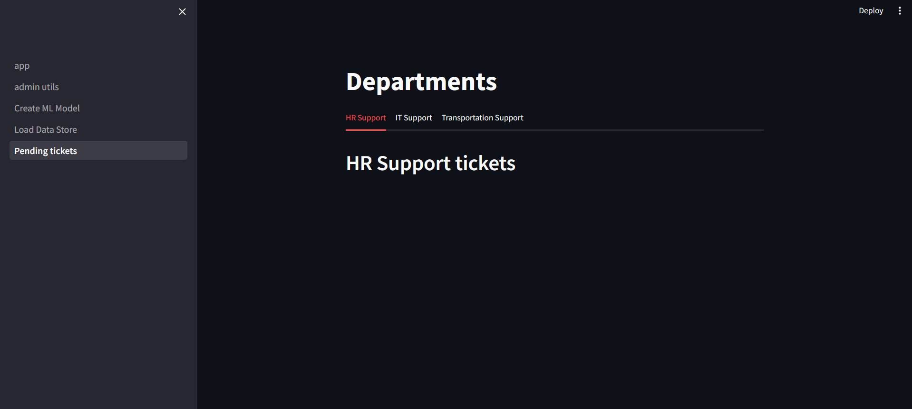

# App 10: Automatic Ticket Classification Tool
+ The app helps answering questions regarding certian company related issues.
+ If user is not satisfied with the response, a ticket can be generated and automatically classified for the admin to review.
+ The app has 3 sections
## Section 1: Loading data
+ Data is read from the documents.
+ It is converted into smaller chunks and created into embbeds.
+ The vectors are pushed onto a pinecone database.
+ Similarity search is performed using the user input and the valid data is retrieved from the datatbase.

## Section 2: Creating ML model
+ Data is read from the csv files and cleaned for training the model.
+ Embebeds are created from this data and split into train and test.
+ A ml model is trained using the svm pre trained model.
+ Accuracy is tested.

## Section 3: Generating a ticket
+ If the user is not satisfied with he response, the user can choose to generate a ticket.
+ Using the custom made ml model, the ticket is classified into one of the 3 categories: HR, IT, Transport
+ The resposne is written onto the streamlit ui

## LLM:
+ all-MiniLM-L6-v2

## Framework:
+ Pinecone
+ streamlit
+ sklearn

[Table of Contents](/README.md)
