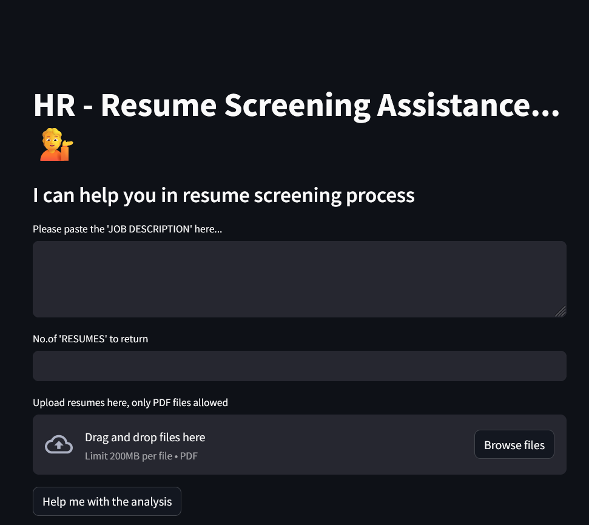

# App 11: Resume Screening Assistance
+ The user uploads resumes to analyze.
+ The app helps in analysis using the user query.
+ The resumes are read and split into smaller chunks.
+ These chunks are converted into embbeds and uploaded onto a pinecone database.
+ Using the user input, a index data is retrieved from the database.
+ The data is summarised using a llm to generate a response.
+ The response is written onto a streamlit ui.

## LLM:
+ OpenAI
+ all-MiniLM-L6-v2

## Framework:
+ LangChain
+ pinecone
+ streamlit

[Table of Contents](/README.md)