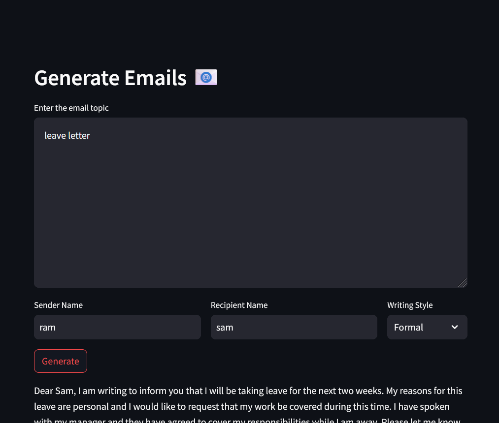

# App 12: Email Generator using LLAMA2
+ Given an emial topic, sender and reciever data, an email body is generated.
+ A prompt template is created to provide context to the llm.
+ The llm generates a response based on the prompt template and the user input.
+ The response is written onto the streamlit ui.

## LLM:
+ llama-2-7b-chat.ggmlv3.q8_0

## Framwork:
+ LangChain
+ streamlit

[Table of Contents](/README.md)