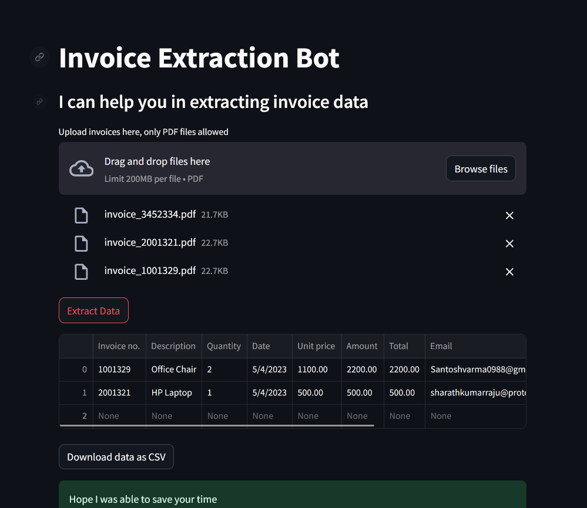

# App 13: Invoice Extraction Bot
+ The app extracts invoice data from the pdfs uploaded.
+ The pdfs are created into a dataframe for the llm.
+ A prompt template is defined to provide instructions to the llm.
+ The llm extracts the invoices using the dataframe and the prompt template.
+ The response is written onto the streamlit ui.

## LLM:
+ OpenAI or llama-2-70b-chat

## Framewrok:
+ LangChain
+ streamlit

[Table of Contents](/README.md)