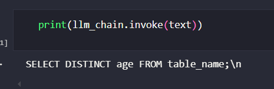

# App 14: Text to SQL Helper Tool
+ Using the user input, the app generates sql query.
+ A pipeline is created using a llm.
+ a prompt template is defined to convert user input to sql for the pipeline.
+ A response is generated and written onto the streamlit ui.

## LLM:
+ Llama-2-7b-chat-hf

## Framework:
+ HuggingFace
+ streamlit
+ torch

[Table of Contents](/README.md)