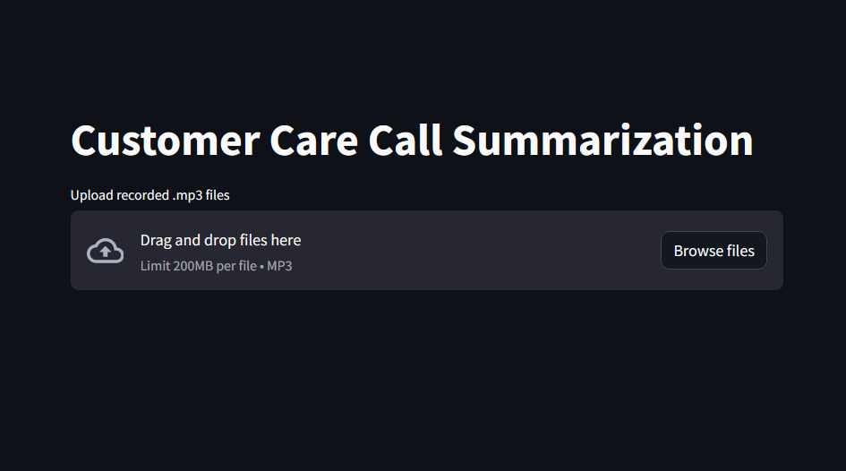

# App 15: Customer Care Call Summary Alert
+ The app summarizes customer care calls and emails it the admin.
+ The uploaded .mp3 files are converted into llm readable data.
+ An agent is created using a llm to summarize the data.
+ The data is emailed to the admin using a prompt template.

## LLM:
+ OpenAI

## Framework:
+ LangChain
+ streamlit
+ whisper
+ Zapier

[Table of Contents](/README.md)