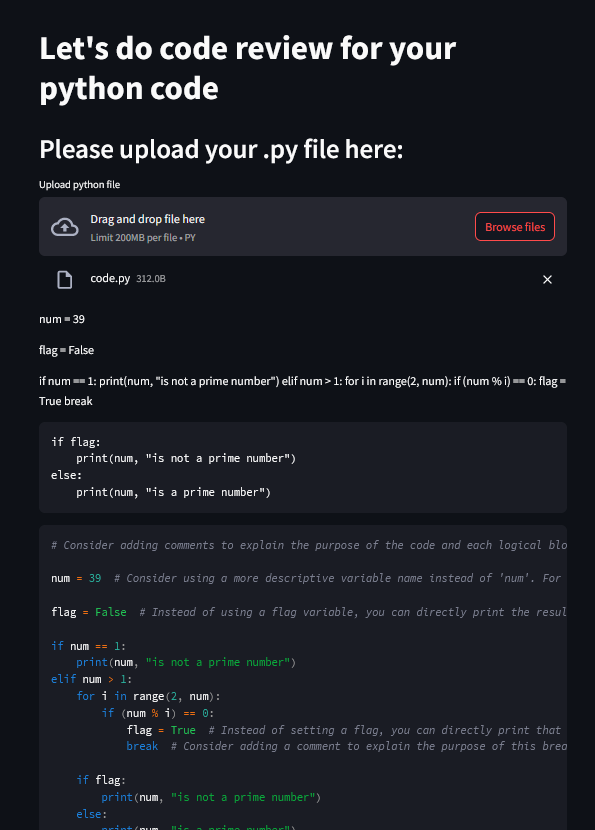

# App 16:  Code Review Analyst App
+ The app analysis the input code and provides improvement to the code with suggestions.
+ Data is read from a python file and converted into llm readable data.
+ A system and human message is defined for the llm.
+ Using the system and human message, the llm generates a response.
+ The respone is written onto the streamlit ui.

# LLM:
+ gpt-3.5-turbo

# Framework:
+ LangChain
+ streamlit

[Table of Contents](/README.md)