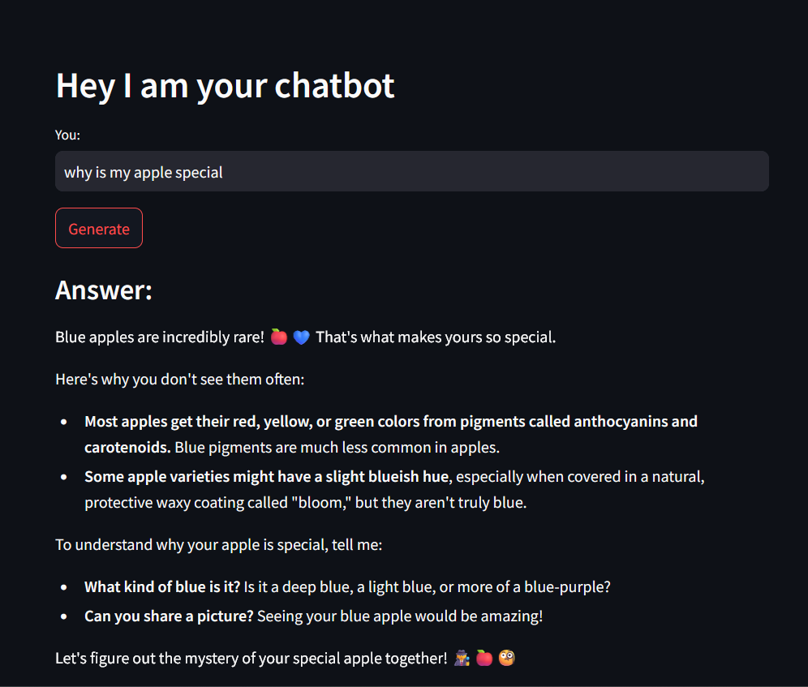

# App 2: Simple Conversational app
+ A minimal conversational chatbot which recalls its past interactions, built using a LLM API similar to [Project 1](#project-1-simple-qa-app)
+ Additionally, the previous chats are stored in a streamlit session state(stores data between sessions).
+ The current query is added onto this session state before generating a response to provide context.
+ Deployed on HuggingFace

## LLM: 
+ gemini-1.5-pro-latest

## Framework:
+ LangChain
+ streamlit