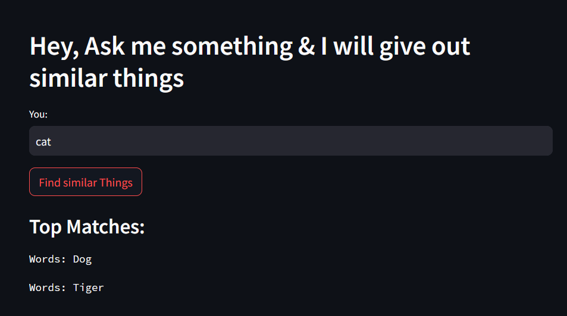

# App 3: Similarity Finder App
+ The app finds words similar to a user-provided input from a given csv file
+ The csv data is converted into embeddings using the llm.
+ The vectors are stored in FIASS database.
+ A similarity search is applied on the input word using the vector database.
+ The output words are displayed onto the streamlit ui.

## LLM: 
+ OpenAI

## Framework:
+ LangChain
+ streamlit