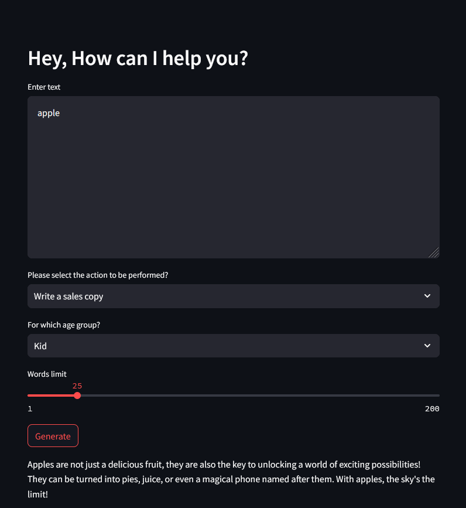

# App 4: Marketing Campaign App
+ Given a description, the app generates marketing content based on the options chosen.
+ The options include an action: sales copy, tweet and product description over an age group: kid, adult and senior citizen.
+ The llm is a given a example selector to select between the age group.
+ The example selector provides context for the response generated for different age groups.
+ the llm generates a response based on the data from the example selector and the prompt table for the input query.
+ The response is written onto the streamlit ui.

## LLM: 
+ gpt-3.5-turbo-instruct

## Framework:
+ LangChain
+ streamlit