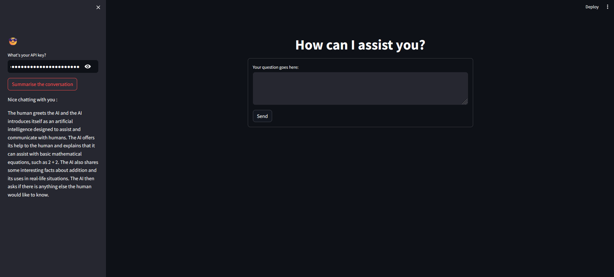

# App 5: ChatGPT Clone with Chat Summarization
+ A chatgpt clone emulated onto a streamlit ui with an extra feature for summarizing the chat between user and ai.
+ For every query, a response is generated and stored in the conversation chain.
+ The conversation chain stores a summary of the past conversations using the llm.
+ The conversation chain is stored in a streamlit session state.

## LLM: 
+ gpt-3.5-turbo-instruct

## Framework:
+ LangChain
+ streamlit

[Table of Contents](/README.md)