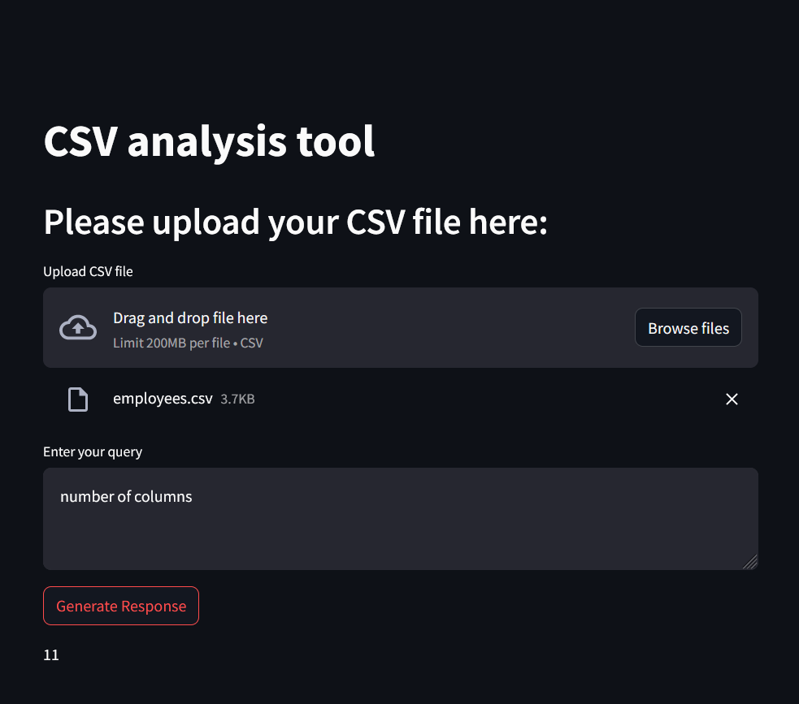

# App 7: CSV Data Analysis Tool
+ The bot performs analysis on csv files.
+ The csv file is first read using the pandas library.
+ The data is converted into a dataframe and fed to a llm.
+ The agent created is used to answer queries and perform actions on the csv data provided.
+ The response is written onto the streamlit ui.

## LLM:
+ OpenAI

## Framework:
+ LangChain
+ Streamlit

[Table of Contents](/README.md)

