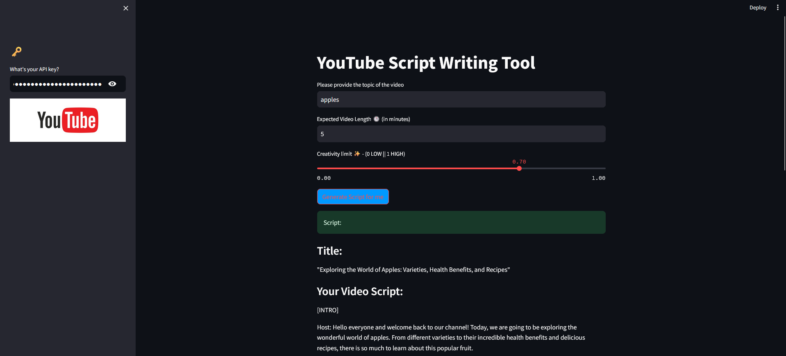

# App 8: YouTube Script Writing Tool
+ Given a title, video length and llm temperature, the app generates a youtube video script.
+ There are 2 prompt templates: title and script which provide prompts for the llm.
+ The user input is sent to a duckduckgo object to provide context and fed to the llm before generating a response.
+ The llm generates a response based on the title and script prompt table and the content from the duckduckgo object.
+ The response is written onto the streamlit ui.

## LLM:
+ gpt-3.5-turbo

## Framework:
+ LangChain
+ streamlit

[Table of Contents](/README.md)