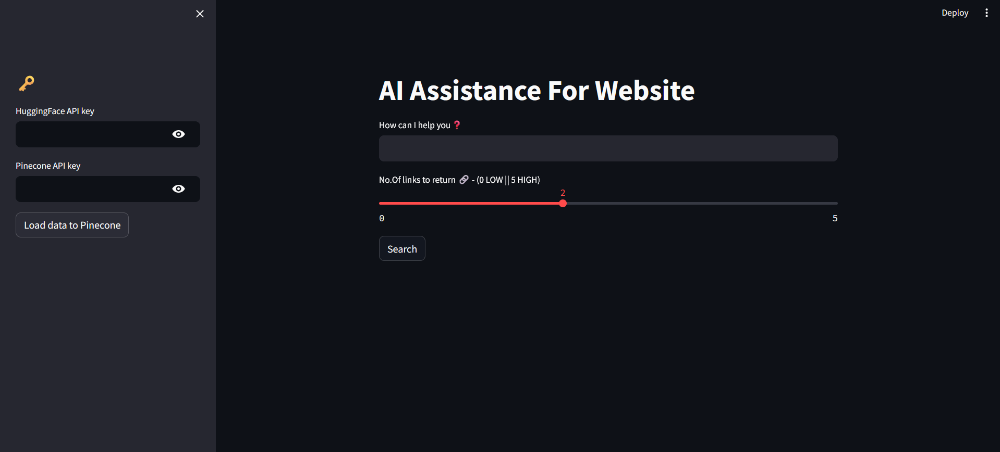

# App 9: ChatBot Support for your Website
+ The app generates links from a given website using the user input.
+ Urls are fetched from the website and converted into smaller chunks.
+ The chunks are converted into embbeds and pushed onto a pinecone databse.
+ Based on the user input, index data is pulled from pinecone database.
+ Similarity search is performer on the retrieved data to generate a response.
+ The response is written onto the streamlit ui.

## LLM:
+ all-MiniLM-L6-v2

## Framework:
+ LangChain
+ Pinecone
+ streamlit

[Table of Contents](/README.md)